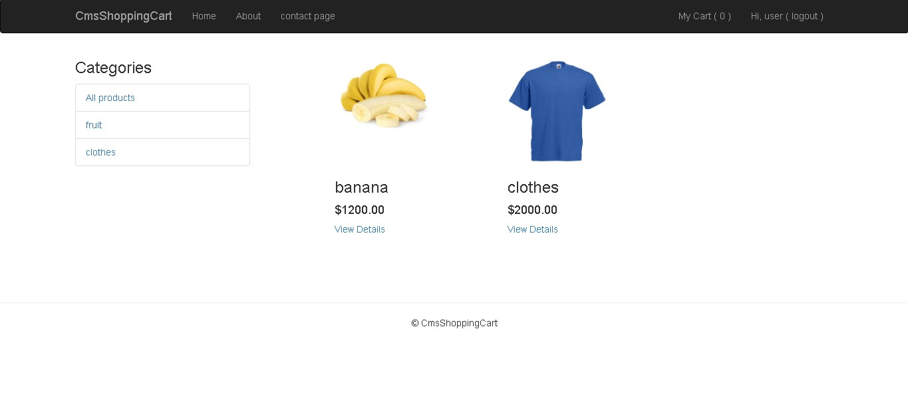

#ScreenShoot

#link demo
https://dwiki-nodejs-shop.herokuapp.com/

#About the app
this is from tutorial <a href="https://www.youtube.com/playlist?list=PL78sHffDjI75uMmHCqxil_YROcHl5ONNj" target="_blank">Eazy Learning</a>

#login
login for user <b>Username: <i>user</i></b> <b>Password: <i>user</i></b>  
login for user <b>Username: <i>admin</i></b> <b>Password: <i>admin</i></b>
